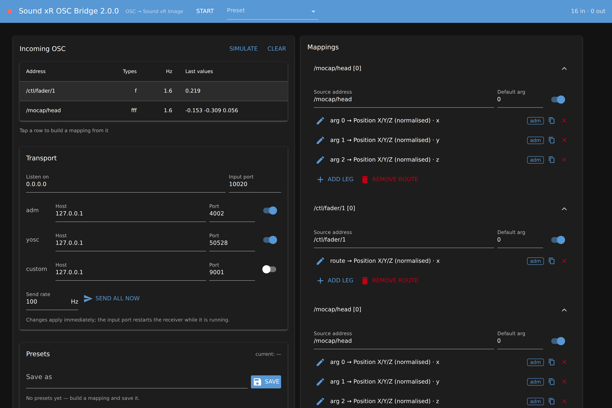
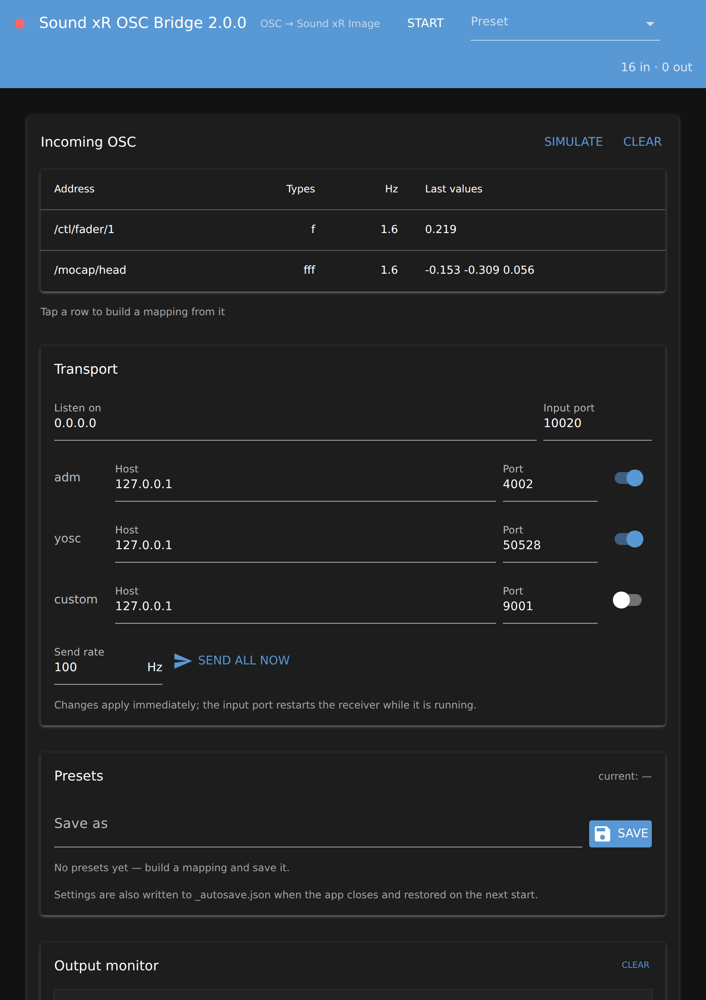

# Sound xR OSC Bridge

Receives arbitrary OSC, learns every address it sees, and maps it onto Yamaha
**Sound xR Image** parameters — ADM-OSC and the native `/yosc:req` protocol —
with non-linear, one-to-many mappings you build by hand.



The interface is a web page the app serves itself. It opens in your browser on
the machine running the bridge, and the same address works from an iPad or a
phone on the same network — so a tablet at the mix position can drive a bridge
running on the show machine.

## Install

**Ready-made application** — no Python needed. Download from
[Releases](../../releases): a `.zip` for Windows and Linux, a `.dmg` for macOS.
Run it, and your browser opens on the interface.

**From source:**

```bash
pip install -r requirements.txt      # python-osc + nicegui
python -m soundxr_bridge             # opens http://localhost:8080
python -m soundxr_bridge myshow.json --start
```

Python 3.10 or newer. Run it on any machine on the same network as the DME
(Sound xR Image accepts up to 8 remote controllers).

| Flag | What it does |
|---|---|
| `--port 8080` | port for the interface |
| `--host 0.0.0.0` | which adapter to serve the interface on |
| `--start` | begin listening immediately, without pressing Start |
| `--no-browser` | do not open a browser window |
| `--headless` | run a preset with no interface at all |

## How it works

**Auto-discovery.** The receiver installs a catch-all handler, so nothing has
to be declared in advance. The table fills as messages arrive and shows, per
address: OSC type tags, message rate, count, the last values, and the min/max
seen so far.

**A route is one incoming address** (wildcards allowed: `/track/*/xyz`).
**A leg is one Sound xR parameter** it drives. Tap a discovered address and the
app builds a route for you — and if that address carries several numbers, one
leg per value, each with the range it has actually been seen using.

**Fan-out is the normal shape.** One input can drive x, width and level at
once, each with its own range and curve. The reverse works too: separate
addresses can write x, y and z of the same object, and the output bus coalesces
them into a single `/adm/obj/n/xyz` message per send tick.

**Every leg picks its own argument.** *Source argument* selects which value of
a multi-argument message feeds that leg — `0`, `1`, `2` … or `-1` to use the
route's default.

**Learn range.** Press it, move the controller through its travel, press stop.
The min/max come from the message stream — every message, not a 4 Hz sample —
and whatever the address did before you pressed Learn is discarded. *Learn
whole route* does every leg in one pass.

**Curves.** `linear`, `exponential`, `logarithmic`, `scurve` — each with an
amount you set by slider, number box or preset button — or `breakpoints`, a
point table you drag directly on the plot. A red cursor rides the curve showing
where the live input currently sits.

## Signal path of one leg

```
raw argument
  → clamp to input range          (optional)
  → normalise to 0…1
  → invert                        (optional)
  → deadzone around the centre    (optional)
  → curve                         linear | exponential | logarithmic | scurve | breakpoints
  → scale to output range
  → quantise                      (optional)
  → smooth (one pole, per message)
  → clamp + cast to the parameter's own type and range
```

Outgoing messages are collected and sent on a timer (default 100 Hz) rather
than per input message. That coalesces multi-argument targets and keeps a fast
tracker feed from flooding the DME. **Nothing is sent when nothing changed** —
so a static input looks silent by design; *Send all now* forces the current
state out.

The **output monitor** logs every message that leaves, marking any it could not
send. It is a debugging tool, not a meter: its switch turns it off for a busy
tracker feed, and turning it off also drops whatever is queued, so re-enabling
starts from the present rather than replaying a backlog.

## Transport

| | default | notes |
|---|---|---|
| Interface | TCP 8080 | the web page; open it from a tablet too |
| OSC input | UDP 9000, all adapters | `0.0.0.0` is the only setting that receives broadcasts |
| ADM-OSC out | UDP 4002 | normalised object control |
| Native yosc out | UDP 50528 | `/yosc:req/set/PROC:Component/…` |
| Custom out | UDP 9001, off | for targets you add yourself |

Set the DME's IP as the host for the output you use, and enable only that one.

## Presets

Everything — ports, destinations, routes, legs, curves, ranges — saves to one
JSON file. The **Preset** dropdown in the header switches between them
immediately; the Presets card saves, loads and deletes them.

They live in `Documents/SoundxR OSC Bridge/presets/` (set `SOUNDXR_DATA_DIR` to
put them elsewhere), so you can copy a show between machines. The current state
is also written to `_autosave.json` when the app closes and restored next time.

## The target catalogue

`soundxr_bridge/targets.json` is plain JSON and is meant to be edited. Each
entry is an address template with index placeholders and typed arguments:

```json
{
  "id": "adm.obj.xyz",
  "protocol": "adm",
  "group": "ADM-OSC / Object",
  "label": "Position X/Y/Z (normalised)",
  "address": "/adm/obj/{obj}/xyz",
  "indices": [{"name": "obj", "label": "Object", "min": 1, "max": 128, "default": 1}],
  "args": [{"name": "x", "type": "float", "min": -1.0, "max": 1.0, "default": 0.0}]
}
```

`"scale"` on an argument only affects the display (the native fader level goes
out as dB × 100, so the editor shows `-4000 = -40 dB` while the wire value
stays an integer). In a packaged build the bundled catalogue is read-only, so a
`targets.json` placed **next to the executable** is merged over it — that is how
you correct an address without a rebuild.

> **Check the addresses before a show.** The catalogue was built from Yamaha's
> published *Sound xR Image on DME OSC Specifications v1.0.0*. Entries flagged
> `"verified": false` — the two reverb parameters and scene recall — were
> reconstructed from summary tables and are almost certainly not spelled right
> for your firmware. Fix them in the JSON once and they are correct for good.
>
> The component ID defaults to `40000`; check yours in the Sound xR Image
> Controller. A wrong ID means messages that arrive and do nothing.

## On a tablet

Start the bridge, note the address it prints (or the one in the Transport
card), and open it in Safari or Chrome on the tablet. The layout stacks into a
single column with finger-sized controls; both views stay in sync.



There is no iOS or Android app and there will not be one: the browser page is
the tablet client. Note the page has **no password** — anyone on the network who
finds the port can change your mappings. Fine on a closed show network, not on
public Wi-Fi.

## Building the application

```powershell
.\build.ps1            # Windows -> dist\SoundxR-OSC-Bridge\
```
```bash
./build.sh             # macOS -> dist/SoundxR-OSC-Bridge.app, Linux -> dist/SoundxR-OSC-Bridge/
```

Both run `packaging/smoke_test.py` afterwards, which starts the packaged binary,
waits for the page and pushes a real OSC message through it — so a missing
asset fails the build instead of shipping.

`.github/workflows/build.yml` builds all four targets (Windows, macOS arm64,
macOS Intel, Linux) on every push, runs the tests and the smoke test, and
attaches the results to a GitHub release when you push a `v*` tag.

**macOS signing** is wired up but dormant: with the four signing secrets set,
the macOS jobs sign, notarise and staple a DMG; without them they produce an
unsigned `.zip` that still works after a right-click → Open. See
[docs/SIGNING.md](docs/SIGNING.md) for exactly what to obtain and where to put
it.

On macOS 15 and later the system asks for local network permission on first
launch — until you agree, the OSC sockets stay silent.

## Tests

```bash
pip install -r requirements-dev.txt    # pytest + pytest-asyncio
python -m pytest tests -q              # 42 tests, no browser and no display needed
```

`pytest-asyncio` is not optional: NiceGUI's `user` fixture is async, and without
the plugin every page test errors with a bare `AssertionError` from pytest's own
fixture machinery. `conftest.py` checks for it and says so in one line.

`tests/test_loopback.py` runs the whole chain over real sockets. `test_webui.py`
drives the actual page through NiceGUI's own harness — clicking buttons and
asserting on what renders — so CI needs no browser.

## Layout

```
soundxr_bridge/
  targets.json      the Sound xR address catalogue (edit me)
  catalog.py        catalogue loading, address templating, units
  osc_io.py         learning receiver, per-protocol senders, diagnostics
  mapping.py        curves, legs, routes, the output bus
  bridge.py         receiver → engine → sender, plus the headless runner
  project.py        the save format
  presets.py        where presets live and how they are named
  webui/app.py      the interface: one page, browser and tablet
packaging/          PyInstaller spec, entry point, signing, smoke test
```

## If something goes wrong

| Symptom | Fix |
|---|---|
| Nothing appears in the discovery table | Allow the app through the firewall on the private network. Check *Listen on* is `0.0.0.0` — a specific address misses broadcasts and other adapters. |
| `Cannot listen … address in use` | Another program holds that input port; close it or choose another. |
| Nothing arrives on the yosc side | ADM-OSC goes to 4002, native yosc to 50528. Check the right output row is enabled — the monitor marks messages it could not send. |
| A leg reads the wrong value of a multi-argument message | Set *Source argument* on that leg instead of leaving it at `-1`. |
| The output monitor stays empty | Either its switch is off, or nothing changed since the last send — press *Send all now*. |
| The browser page never opens | Run with `--no-browser` and open the printed address yourself. |
| macOS: the app runs but hears nothing | Allow local network access when prompted (System Settings → Privacy & Security → Local Network). |
